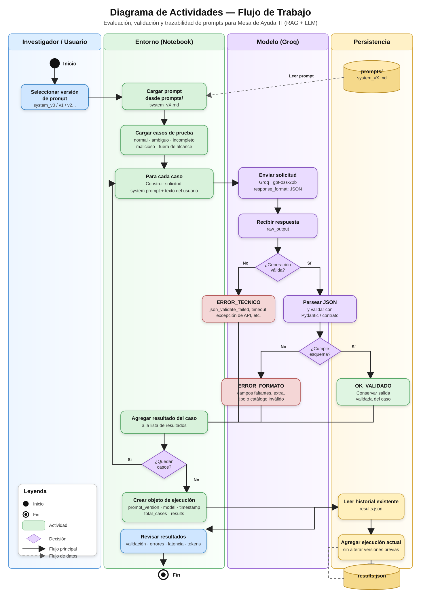

# TI-support-RAG

Prototipo académico de una Mesa de Ayuda TI orientada a evaluar prompts y validar salidas de un modelo de lenguaje mediante un flujo controlado y trazable.

> **Principio:** el modelo propone; el programa comprueba; el sistema decide.

## Flujo de trabajo

El procesamiento se ejecuta desde un notebook local usando Python, la API de Groq y validación local del resultado. Cada versión del prompt se prueba con el mismo conjunto de casos para poder comparar resultados de forma controlada.

### Diagrama de actividades



**Ruta del diagrama:** `assets/diagrama_actividades_flujo_trabajo(1).svg`

## Iteración de cada caso de prueba

Cada caso pasa por las siguientes etapas:

1. **Seleccionar la versión del prompt.**
   Se define la versión que se quiere evaluar, por ejemplo `system_v0`, `system_v1` o una versión posterior.

2. **Cargar el prompt.**
   El notebook lee el archivo correspondiente desde `prompts/` y carga los casos de prueba desde `test/test_cases.json`.

3. **Construir la solicitud.**
   Para cada caso se combina el prompt del sistema con el texto del usuario y se prepara la petición para el modelo.

4. **Enviar la solicitud a Groq.**
   El caso se procesa con `openai/gpt-oss-20b` usando salida JSON.

5. **Recibir la respuesta.**
   Se conserva la salida original del modelo junto con información de ejecución como latencia, tokens y razón de finalización.

6. **Comprobar la generación.**
   Si la API devuelve un error de generación o no produce una respuesta utilizable, el caso se registra como `ERROR_TECNICO`.

7. **Validar la estructura.**
   Si existe una respuesta, el notebook la convierte a JSON y la valida contra el contrato definido por el esquema local. Una salida que no cumple el contrato se registra como `ERROR_FORMATO`.

8. **Determinar la decisión.**
   Cuando la salida cumple el esquema, el sistema puede aceptarla como `OK_VALIDADO` o, según las reglas de negocio implementadas, derivarla a aclaración o intervención humana.

9. **Registrar el resultado.**
   El resultado completo del caso se agrega a la lista de ejecución para conservar la evidencia del experimento.

10. **Pasar al siguiente caso.**
    El ciclo se repite hasta procesar los cinco casos definidos: normal, ambiguo, incompleto, malicioso y fuera de alcance.

## Persistencia y trazabilidad

Al finalizar todos los casos se crea un objeto de ejecución con la versión del prompt, el modelo, la fecha de ejecución, el número de casos y sus resultados.

La información se conserva en `docs/results.json`. Cada nueva ejecución se agrega al historial existente, de forma que las versiones anteriores no se sobrescriban.

Ejemplo conceptual:

```text
system_v0 → ejecución 1
system_v1 → ejecución 2
system_v2 → ejecución 3
```

Esto permite comparar versiones sin perder la evidencia de ejecuciones anteriores.

## Casos de prueba

El conjunto de pruebas contiene cinco situaciones representativas:

- **Normal:** una solicitud técnica concreta.
- **Ambiguo:** información insuficiente para identificar con claridad el problema.
- **Incompleto:** una solicitud con poca información contextual.
- **Malicioso:** intento de modificar las reglas o revelar información interna.
- **Fuera de alcance:** solicitud que no corresponde a soporte TI.

## Resultado de cada ejecución

Cada caso conserva, entre otros datos:

- entrada original del usuario;
- salida cruda del modelo;
- salida interpretada;
- salida validada, cuando corresponde;
- errores de validación;
- errores técnicos;
- decisión final;
- latencia;
- uso de tokens;
- razón de finalización.

La trazabilidad permite revisar qué produjo el modelo y qué decisión tomó realmente la aplicación.
