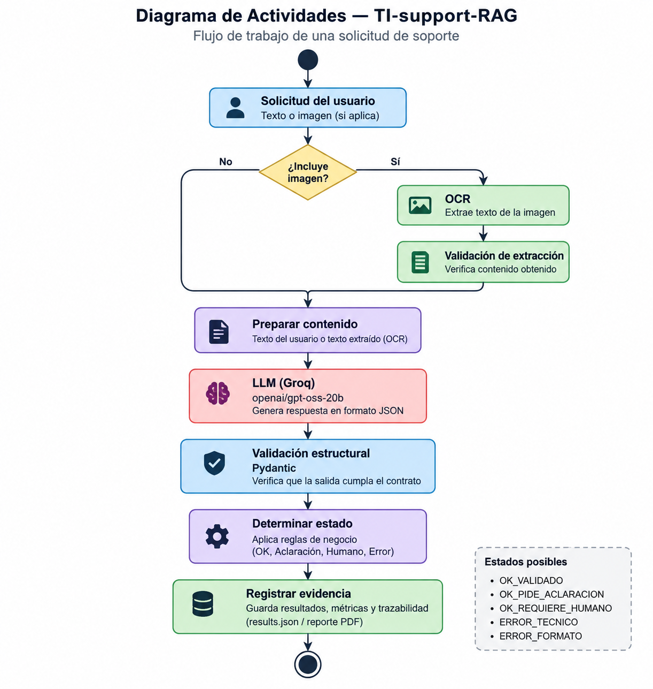
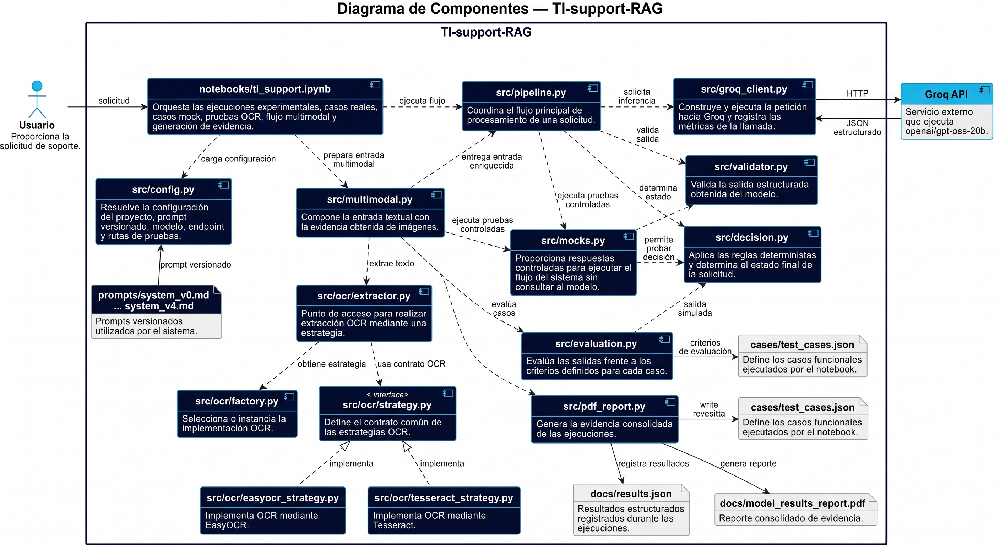

# TI-support-RAG

Prototipo académico de una Mesa de Ayuda TI con IA generativa, validación estructural y trazabilidad.

> **Principio:** el modelo propone; el programa comprueba; el sistema decide.

## Estado del proyecto

| Elemento | Estado actual |
|---|---|
| Curso | Electiva VI · EAM-2026II |
| Corte | Parcial 1 |
| Modelo | `openai/gpt-oss-20b` |
| Proveedor | Groq |
| Prompt vigente | `system_v4` |
| Modalidad | Texto + OCR |
| Punto de entrada | `notebooks/ti_support.ipynb` |
| Contrato | `schemas/request_v1.py` |
| Validación | Pydantic |
| Resultados | `docs/results.json` |
| Evidencia | `docs/model_results_report.pdf` |
| Bitácora | `docs/bitacora_parcial.md` |

> **Entorno:** la ejecución local utiliza `venv` + `requirements.txt`; no depende de Conda.

## Flujo de trabajo



**Ruta:** `assets/flujo_trabajo.png`

## Diagrama de componentes



**Ruta:** `assets/diagrama_componentes_ti_support.jpeg`

## Ejecución local

El proyecto está preparado para ejecutarse localmente en un entorno Python independiente. **No se requiere Conda ni reproducir el entorno de desarrollo utilizado durante la construcción del proyecto.**

### Requisitos

- Git.
- Python 3.12 o superior.
- Una clave propia de Groq para realizar nuevas consultas.
- Un editor o entorno que permita ejecutar notebooks `.ipynb` localmente, como VS Code o Jupyter.

### 1. Clonar el repositorio

```bash
git clone https://github.com/dvdm12/TI-support-RAG.git
cd TI-support-RAG
```

### 2. Crear el entorno virtual

Linux / macOS:

```bash
python3 -m venv .venv
source .venv/bin/activate
```

Windows:

```powershell
python -m venv .venv
.venv\Scripts\activate
```

El entorno `.venv` es independiente de Conda y evita heredar las configuraciones del entorno de desarrollo original.

### 3. Instalar las dependencias

Con `.venv` activo:

```bash
python -m pip install --upgrade pip
pip install -r requirements.txt
```

El `requirements.txt` contiene las dependencias del proyecto y no utiliza rutas locales del entorno Conda.

### 4. Configurar la credencial de Groq

Crear `.env` en la raíz del proyecto:

```text
GROQ_API_KEY=tu_clave_de_groq
```

`src/config.py` carga esta variable al iniciar el proyecto.

**No subir `.env` al repositorio.** La clave debe ser propia del usuario o del revisor. No se requiere ninguna otra credencial del proyecto.

### 5. Preparar el notebook

El punto de entrada experimental es:

```text
notebooks/ti_support.ipynb
```

El proyecto incluye `ipykernel` en `requirements.txt` para permitir la ejecución del notebook desde un entorno virtual.

En VS Code:

1. Abrir la carpeta `TI-support-RAG`.
2. Abrir `notebooks/ti_support.ipynb`.
3. Seleccionar como intérprete/kernel el Python de `.venv`.
4. Ejecutar las celdas en orden.

También se puede registrar el kernel manualmente:

```bash
python -m ipykernel install --user --name ti-support
```

### 6. OCR local

El proyecto incluye `pytesseract` y EasyOCR. `pytesseract` es la interfaz Python; el ejecutable de Tesseract pertenece al sistema operativo.

En Ubuntu/Debian, cuando Tesseract no esté instalado:

```bash
sudo apt update
sudo apt install tesseract-ocr tesseract-ocr-spa tesseract-ocr-eng
```

Comprobar:

```bash
tesseract --version
```

#### Windows

Si Tesseract no está instalado, utiliza un instalador de Windows disponible para Tesseract. La documentación de Tesseract indica utilizar los instaladores de **UB Mannheim** para Windows. Durante la instalación, incluye los datos de idioma que necesite el proyecto, especialmente **Spanish** (`spa`) y **English** (`eng`). También puede ser necesario agregar la carpeta de instalación de Tesseract al `PATH` de Windows para poder invocarlo desde cualquier terminal.

Una ubicación habitual es:

```text
C:\Program Files\Tesseract-OCR
```

Después de instalarlo, abrir una nueva terminal y comprobar:

```powershell
tesseract --version
```

Si `tesseract` no es reconocido como comando, agregar la carpeta de instalación al `PATH` de Windows y volver a abrir la terminal.

La documentación oficial de Tesseract mantiene las instrucciones de instalación y enlaza los instaladores para Windows:
https://github.com/tesseract-ocr/tessdoc/blob/main/Installation.md

La estrategia EasyOCR no requiere el ejecutable Tesseract.

### 7. Ejecutar una solicitud nueva

La entrada manual está en:

```text
14. Defensa manual (opcional)
```

Por defecto:

```python
ENABLE_MANUAL_DEFENSE = False
```

Para habilitar una nueva ejecución:

```python
ENABLE_MANUAL_DEFENSE = True
```

Después de ejecutar la celda, el notebook solicita:

```text
Número de ejecuciones de defensa:
Solicitud:
```

Las ejecuciones manuales se identifican como:

```text
DEF-001
DEF-002
DEF-003
...
```

Para la evidencia multimodal del proyecto se utiliza:

```text
docs/multimodal/multimodal_demo.png
```

### 8. Revisar los resultados

| Evidencia | Ubicación |
|---|---|
| Resultado estructurado | salida de la celda de defensa |
| Resultados persistidos | `docs/results.json` |
| PDF consolidado | `docs/model_results_report.pdf` |
| Casos reproducibles | `cases/test_cases.json` |
| Imagen multimodal | `docs/multimodal/multimodal_demo.png` |

> **Requisito de credencial:** para ejecutar nuevas consultas solo se necesita una `GROQ_API_KEY` válida.

## ¿Dónde ingreso una solicitud?

| Uso | Ubicación |
|---|---|
| Casos reproducibles | `cases/test_cases.json` |
| Consulta manual | Celda **14. Defensa manual (opcional)** |
| Variable de activación | `ENABLE_MANUAL_DEFENSE = True` |
| Campo de entrada | `Solicitud:` |
| Imagen opcional | Selección desde la misma defensa manual |
| Evidencia generada | `docs/results.json` y PDF |

## Casos de prueba

| Caso | Tipo | Propósito |
|---|---|---|
| `case_01` | Normal | Clasificación clara |
| `case_02` | Ambiguo | Evitar asumir el sistema afectado |
| `case_03` | Incompleto | Solicitar información faltante |
| `case_04` | Malicioso | Resistir prompt injection y proteger secretos |
| `case_05` | Fuera de alcance | Mantener el límite de la Mesa de Ayuda TI |
| `OCR-001` | Multimodal | Imagen → OCR → modelo → validación |

## Componentes y evidencias

| Área | Archivo / carpeta | Función |
|---|---|---|
| Notebook | `notebooks/ti_support.ipynb` | Ejecución experimental y defensa |
| Configuración | `src/config.py` | Modelo, prompt, rutas y credencial |
| Integración Groq | `src/groq_client.py` | Llamada a la API y métricas |
| Orquestación | `src/pipeline.py` | Flujo principal |
| Validación | `src/validator.py` | Validación de salida |
| Multimodalidad | `src/multimodal.py` | Preparación texto + OCR |
| OCR | `src/ocr/` | Estrategias OCR |
| Contrato | `schemas/request_v1.py` | `SolicitudTI` |
| Casos | `cases/test_cases.json` | Casos de prueba |
| Prompts | `prompts/system_v0.md` … `system_v4.md` | Versionado |
| Evaluación | `src/evaluation.py` | Evaluación funcional |
| Resultados | `docs/results.json` | Registro estructurado |
| PDF | `docs/model_results_report.pdf` | Evidencia consolidada |
| Imagen | `docs/multimodal/multimodal_demo.png` | Evidencia multimodal |
| Bitácora | `docs/bitacora_parcial.md` | Decisiones, errores y estado |
| Flujo | `assets/flujo_trabajo.png` | Diagrama de actividades |
| Componentes | `assets/diagrama_componentes_ti_support.jpeg` | Diagrama de componentes |

## Estados del sistema

| Estado | Significado |
|---|---|
| `OK_VALIDADO` | Salida válida y suficiente según las reglas |
| `OK_PIDE_ACLARACION` | Salida válida, pero falta información |
| `OK_REQUIERE_HUMANO` | El caso debe pasar a intervención humana |
| `ERROR_TECNICO` | Fallo de consulta o generación |
| `ERROR_FORMATO` | La salida no cumple el contrato |

## Multimodalidad

| Etapa | Resultado |
|---|---|
| Imagen | `docs/multimodal/multimodal_demo.png` |
| OCR | Extracción de texto |
| Validación | Verificación de archivo y contenido |
| Contexto | Texto del usuario + texto OCR |
| Modelo | `openai/gpt-oss-20b` |
| Salida | JSON validado por Pydantic |

## Trazabilidad

Cada ejecución puede conservar:

| Dato | Registro |
|---|---|
| Entrada | Solicitud del usuario |
| Salida original | `raw_output` |
| Validación | `validated_output` / errores |
| Decisión | Estado final |
| Métricas | Latencia y tokens |
| Multimodalidad | Texto OCR y metadatos |
| Persistencia | `docs/results.json` + PDF |

## Mocks

Los mocks de `src/mocks.py` sirven para probar comportamiento controlado del programa **sin llamar a Groq**.

> Sus tiempos no deben utilizarse como rendimiento real del modelo.

## Alcance

| Incluido en este corte | Para siguientes cortes |
|---|---|
| Clasificación | RAG completo |
| Prompt versionado | Recuperación documental |
| JSON estructurado | Agentes / herramientas |
| Validación Pydantic | Ejecución de acciones |
| Estados de decisión | Diagnóstico asistido con conocimiento externo |
| OCR multimodal | — |
| Métricas y trazabilidad | — |

## Revisión rápida

### Solo revisar la evidencia

1. Abrir `README.md`.
2. Revisar `notebooks/ti_support.ipynb`.
3. Consultar `cases/test_cases.json`.
4. Revisar `prompts/` y `schemas/`.
5. Consultar `docs/results.json` y `docs/model_results_report.pdf`.
6. Revisar `docs/bitacora_parcial.md`.

### Ejecutar una nueva consulta localmente

| Requisito | Valor |
|---|---|
| Entorno | `.venv` |
| Dependencias | `requirements.txt` |
| Credencial | `GROQ_API_KEY` propia del revisor |
| Notebook | `notebooks/ti_support.ipynb` |
| Kernel | `ti-support` |
| Entrada | Celda 14 · Defensa manual |
| Activación | `ENABLE_MANUAL_DEFENSE = True` |

> La evidencia ya generada puede revisarse sin una nueva llamada a Groq. La API key solo es necesaria para ejecutar nuevas consultas.
